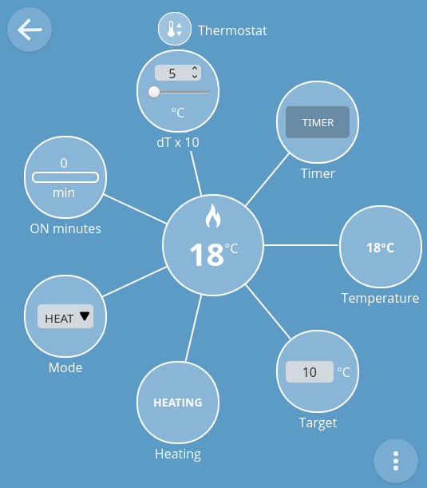
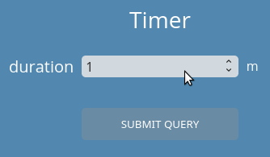

# webThing thermostat

## Introduction

WebThing Thermostat is prepared for ESP32 CPUs and uses esp-idf environment (current stable version: 4.1).

Thermostat keeps the temperature around the set value by turning the heat source ON and OFF. Temperature is measured with DS18B20 1-wire temperature sensor.

## Dependencies

Requires:

 * [web-thing-server](https://github.com/KrzysztofZurek1973/webthings-components/tree/master/web_thing_server) from ```webthings-components```
 * [esp32-owb](https://github.com/DavidAntliff/esp32-owb) for 1-wire bus
 * [esp32-ds18b20](https://github.com/DavidAntliff/esp32-ds18b20) for DS18B20 sensor

## Example

See [webthings-node-example-project](https://github.com/KrzysztofZurek1973/webthings-node-example-project)

## Features



This webThing has the following properties and one action:

 * Target temperature (Ts)
 * Temperature (Tc), current temperature read from sensor
 * Hysteresis (dT x 10), controller will try to maintain the temperature in the range from Ts - (dT/10) to Ts + (dT/10), e.g. Ts = 15, dT = 20, then T_high = 15 + 2 = 17, T_low = 15 - 2 = 13, it turns OFF the heater when Tc > 17 and turns ON the heater when Tc < 13
 * mode:
 	* AUTO, temperature is regulated around Ts
 	* HEAT, heater is ON, regardless of Tc
 	* OFF, heater is OFF, regardless of Tc
 * Heating, shows if heating is ON or OFF
 * ON minutes, minutes when heater was ON for the current day, cleared on midnight
 * Timer (action), turn ON the heater for a certain number of minutes
 
 

## Documentation

See [webthings-empty-project](https://github.com/KrzysztofZurek1973/webthings-empty-project) and follow steps described in **Build webThing Device** chapter.

In point 5 download ```webthing-thermostat``` repository. In function ```init_things()``` call ```init_thermostat()``` and include ```thing_thermostat.h``` in your main project file.

## Source Code

The source is available from [GitHub](https://github.com/KrzysztofZurek1973).

## Prototype

In the ```prototype``` folder there are schematic files, gerber files and a photo of the working prototype device. This device is built with ESP32 DevKitC.

## Links

* [WebThing Gateway](https://webthings.io/gateway/) - https://webthings.io/gateway/
* [Web Thing API](https://webthings.io/api/) - https://webthings.io/api/
* [esp-idf](https://github.com/espressif/esp-idf) - https://github.com/espressif/esp-idf

## License

This project is licensed under the MIT License.

## Authors

* **Krzysztof Zurek** - [github](https://github.com/KrzysztofZurek1973)


